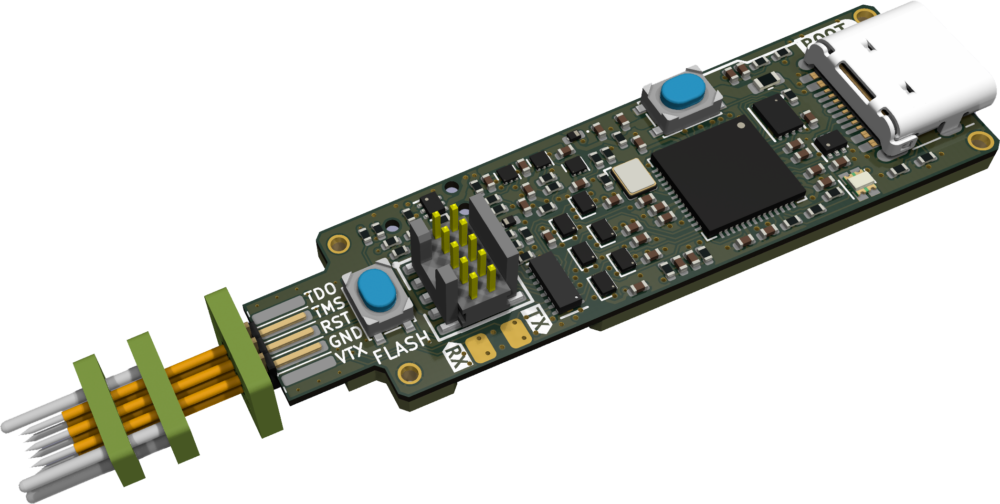
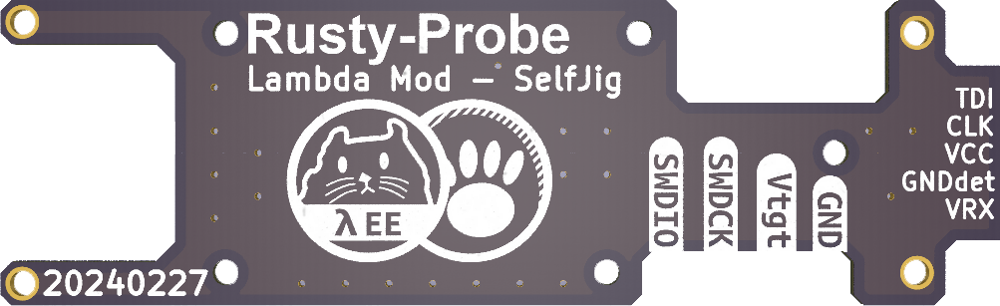
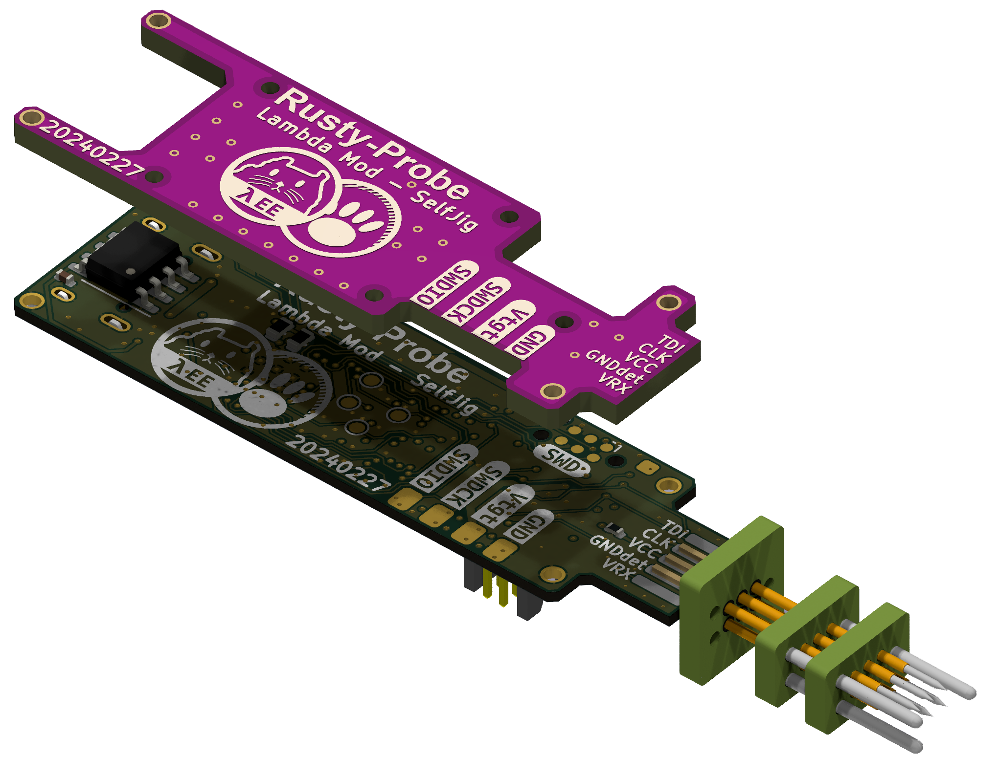
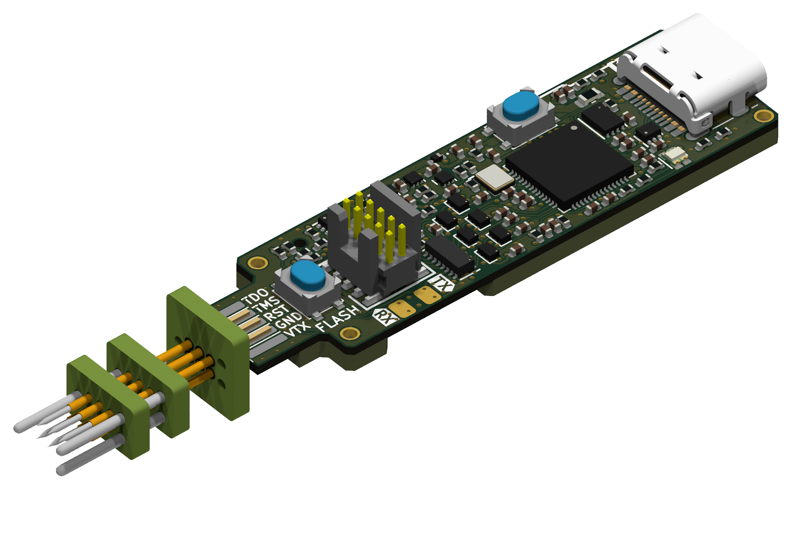
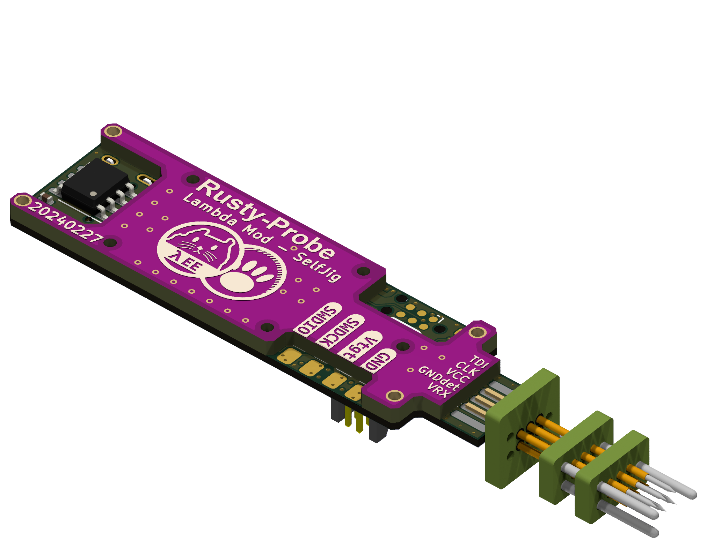

# The Rusty Probe

This is an open hardware probe for the Serial Wire Debug (SWD) and JTAG protocol.
Based on the RP2040 MCU.


Following image is forked and modified PCB 3D rendering.
This repo is modified PCB data details are descirbed in [here](#modification-on-this-forked-repo)

## Firmware

The firmware is available [here](https://github.com/probe-rs/rusty-probe-firmware) and is open-source.

## Features

- The 10-pin Cortex-Debug connector is used.
- The programming connector is the Tag Connect TC2030, however for just loading firmware the USB bootloader is recommended.
- Castellated vias for all programming pins, power and 2 GPIOs.
- USB-C connector.
- Target 5V and `Vtarget` is protected with an diode circuit to not have current flow from the target to the host.
- The probe support 1.8v - 3.3v signal voltage and can track `Vtarget`.
- The key pin on the Cortex-Debug can be connected to the protected 5V.

The schematic can be found in the GitHub actions, full production files are generated for each commit.


## Comparison

Here is a small comparison with a few different probes:

|                       | Rusty Probe            | PicoProbe   | Raspberry Pi Debug Probe | STLinkV3           | JLink              |
|-----------------------|------------------------|-------------|--------------------------|--------------------|--------------------|
| Max speed             | 62 MHz                 | ?           | 10 MHz                   | 24 MHz             | 15 MHz             |
| Target support        | any                    | any         | any                      | STM32              | any                |
| IO voltage control    | 1.8-3.3V               | 3.3V        | 3.3V                     | 1.6-3.3V           | 1.6-3.3V somtimes  |
| Type                  | Open Source & Hardware | Open Source | Proprietary              | Proprietary        | Proprietary        |
| Language              | Rust                   | C           | C                        | C                  | C                  |
| Protocol              | CMSIS-DAP              | CMSIS-DAP   | CMSIS-DAP                | Proprietary        | CMSIS-DAP          |
| Programming connector | Cortex-M Debug 10p     | -           | JST                      | Cortex-M Debug 14p | Cortex-M Debug 10p |
| USB speed             | 12 MBit/s              | 12 MBit/s   | 12 MBit/s                | 480 MBit/s         | 12 MBit/s          |

## Where to buy

The original probe is available in the [probe-rs shop](https://shop.probe.rs/). But you are free to build one yourself as well!

## License

This work is licensed under [CERN-OHL-P](cern_ohl_p_v2.txt).

# Modification on this forked repo

The existing rusty-probe has been modified for a practical experiment aiming to enable on-site, real-time firmware updates by individuals without programming knowledge. This modification incorporates BillMock-HW to facilitate firmware updates without the need for a computer.

## PCB Stack-Up
|          |                    |
| -------- | ------------------ |
| Layer    | 4 Layer            |
| Material | FR4                |
| Impedence Control | Don't care (But choosed `JLC04081H-3313` ) |
| Thickness | **0.8 mm**        |

In the modified board, a 1.27mm pin header is positioned at the left end to facilitate connection with a PogoProbe. The board is designed with a thickness of 0.8mm, considering the recommended thickness for the USB-C connector. While the original PCB uses 1.6mm thickness, using the USB-C connector directly (without PogoProbe) allows for the use of 1.6mm thickness as well.

By opting for the 0.8mm thickness, the durability of the PCB might be compromised. To address this, a BackPlane board is employed to reinforce and augment the insufficient rigidity.

| Front   | Back    |
| ------- | ------- |
|  |  |
|  |  |
|  |  |
## Panelization 
JLCPCB's Panelization requires a minimum size of 70mm x 70mm when placing PCBs along the Edge Rail. To meet this requirement, I rotated the PCB by 90 degrees and arranged them in a 4x1 configuration. Additionally, I inserted a dummy bar in the middle for successful Panelization.

### Panlization by cli
```sh
# KiKit Required
cd ./panelize
./panelize_4batch.sh
```

## Changed Note
- Default `W25Q8` is replaced to `IS25WP016D` for custom code.
- Switch `EVQ-P2002W` is replaced to `TS-1145A-C-B` by personal ease of supply and demand of parts.
- Number of tact switch replaced to `TS-1145A-C-B` is changed to **2** from 1. Extra SW2 is connected to GPIO1. The plan of GPIO1 is using for USER input button (Ex Self Programming Button)
- Replace `74LVC1T45` to `X2-DFN1410-6` package and associated part.
- Castellated holes are removed for reducing the small scale unit production cost.
- The addition of a 5x2 SMD pad, designed to accommodate a 1.27mm pin header for vertical connection on the left side, has been made. This pad is intended for connecting a custom Pogo Pin (https://gitlab.com/michael1308/pogoprobe) and currently follows the pinout of the TC-2030 for consideration in the pin mapping of the personal project.
- Optionally added an I2C FRAM on the PCB bottom layer for data logging or frequent data storage purposes.
- Changed the selection of resistors and capacitors to those available in the JLCPCB Basic Part list.
- PCB width is increased to 49.9 mm from 40.0 mm
- Added and modified parameters to enable direct production with JLCPCB.
- Some libraries are referenced from [Lambda_KICAD_LIB](https://github.com/pmnxis/Lambda_KICAD_LIB)
kicad